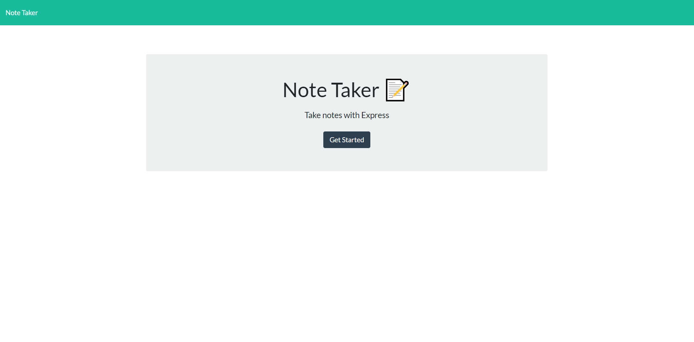
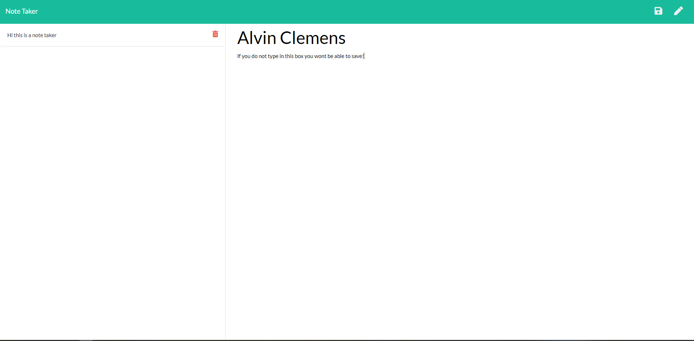

# Server Based Note Taker
  
  ### Author
  Alvin Clemens    

  ## Table of Contents
  * [Description](#description)
  * [Initallation instruction](#installation)
  * [User information](#usage)
  * [Licence](#licence)
  * [Contributors](#contributors)

  
  
  ## Description
  This project was ment to make a note taking app that could be used anywhere hosted on the Heroku platform. When you go to the site you are meet with the landing page.
  
  

  When you click on the "Get Started" button you will be taken to the notes.html page where you will be able to take notes. To save your notes you will need to enter in both a title and the note itself befor being propted to save. This will one help you find the needed notes later on. Once your note is saved you will see it apper on the left hand side, clearing the two text boxes. To delete you will need to click on the trash can icon and refresh the browser.
  
  

  ## Licences used?
  MIT

  ## Installation instructions
To continue working on this you will need to install the express to work on this app and I would also recomend downloading Huroku live to work on it.

  ## Contributors
  If was anything that they wish to add when it comes to functionality by all means add it into the code.

  ## Usage
  I will continue to use this app as a project todo list. It is a quick and easy set up and can be accesed on multipule computers.

  ## Test instructions
  No test for this one.

  ## Github
  

  Email: Alvinclemens@gmail.com

  Github: Cloggedbat

